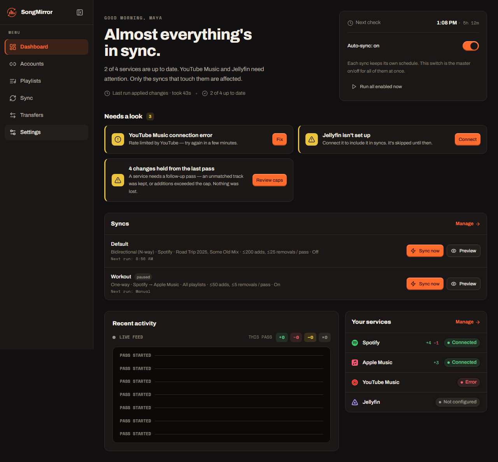
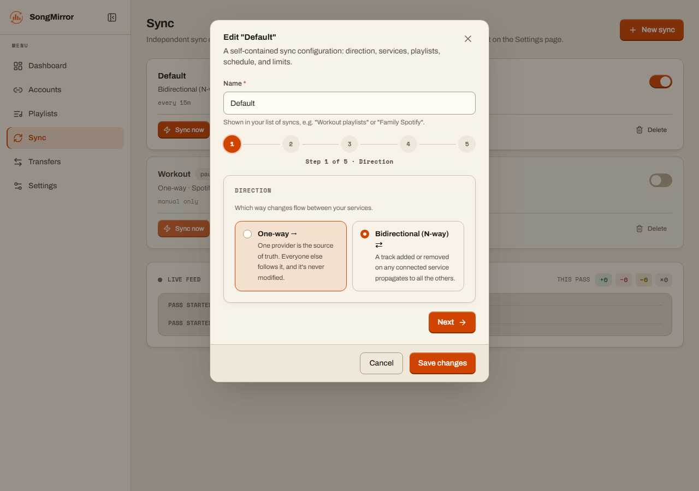
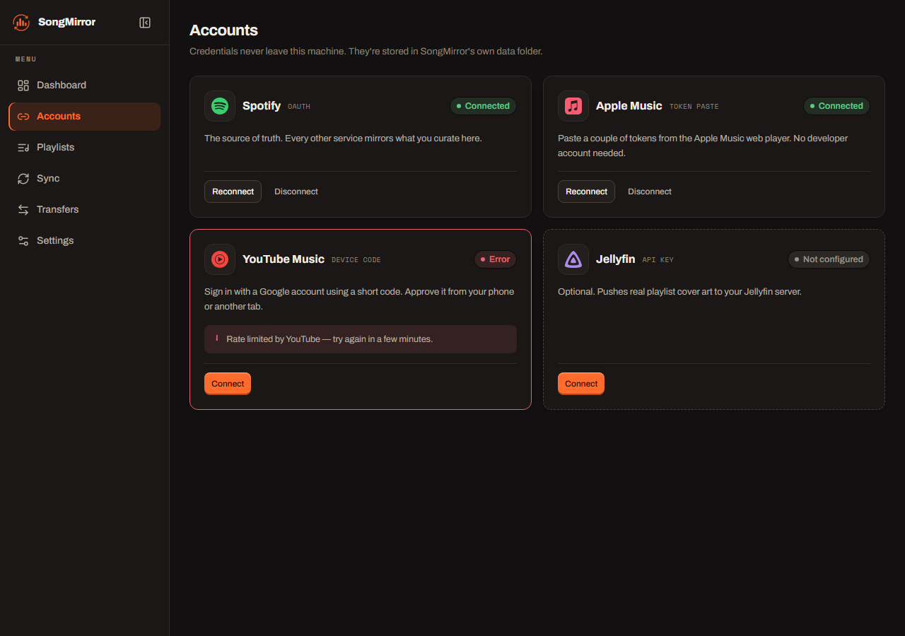
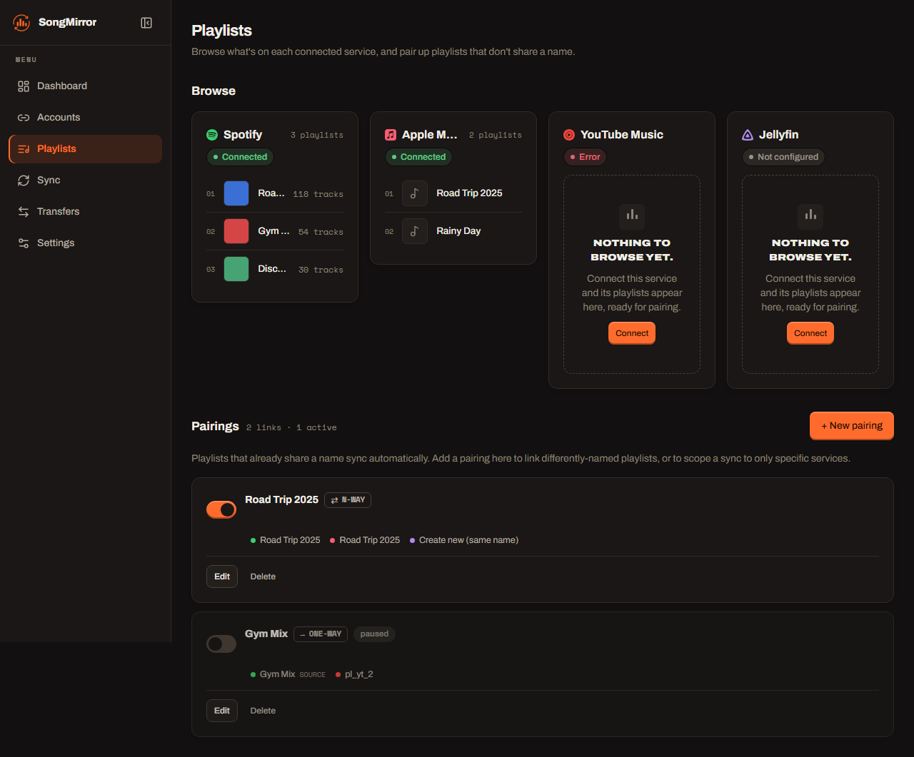

<div align="center"><a name="readme-top"></a>

<picture>
  <source media="(prefers-color-scheme: dark)" srcset="./.github/assets/lockup-dark.png">
  
</picture>

# SongMirror

Self-hosted, always-on **playlist sync for Spotify, TIDAL, Qobuz, Deezer, Amazon Music, Apple Music, and YouTube Music** — plus a local, Jellyfin-ready audio mirror.<br/>
A free, open-source, **self-hosted alternative to Soundiiz, TuneMyMusic, and FreeYourMusic** that _you_ own and run.

**One-way, authoritative-group, or full bidirectional (N-way) sync · one-off playlist transfers · ISRC-accurate matching · all from your browser**

[Quick Start](#-quick-start) · [Features](#-features) · [Screenshots](#-screenshots) · [Docker](#-always-running-docker) · [How it works](#-how-it-works) · [Report Bug][github-issues-link] · [Request Feature][github-issues-link]

<!-- SHIELD GROUP -->

[![CI][ci-shield]][ci-link]
[![License][license-shield]][license-link]
[![Python][python-shield]][python-link]
[![Docker][docker-shield]][docker-link]<br/>
[![Stars][stars-shield]][stars-link]
[![Forks][forks-shield]][forks-link]
[![Issues][issues-shield]][issues-link]
[![Last commit][last-commit-shield]][last-commit-link]

**Share this project**

[![][share-x-shield]][share-x-link]
[![][share-reddit-shield]][share-reddit-link]
[![][share-linkedin-shield]][share-linkedin-link]

<sup>Set it up once — every playlist you curate stays mirrored across every service, in date-added order.</sup>

<a href="./.github/assets/songmirror-demo.mp4"></a>

<sup>▶ <a href="./.github/assets/songmirror-demo.mp4">Watch the 1080p version</a></sup>

</div>

> [!NOTE]
> **Web app + headless CLI, one engine.** Click through a browser UI to connect services, build syncs, and transfer playlists — or run it `.env` + cron style. Both drive the same sync core.

<details>
<summary><kbd>Table of contents</kbd></summary>

#### TOC

- [✨ Features](#-features)
- [📸 Screenshots](#-screenshots)
- [🚀 Quick Start](#-quick-start)
- [🐳 Always running: Docker](#-always-running-docker)
- [⚙️ How it works](#-how-it-works)
  - [Matching](#matching)
  - [Authoritative groups](#authoritative-groups)
  - [Bidirectional (N-way) sync](#bidirectional-n-way-sync)
- [📦 Playlist metadata backups](#-playlist-metadata-backups)
- [💿 Local download mirror (Jellyfin)](#-local-download-mirror-jellyfin)
- [🔌 Connecting each service](#-connecting-each-service)
  - [Credential renewal](#credential-renewal)
  - [Spotify](#spotify)
  - [TIDAL](#tidal)
  - [Qobuz](#qobuz)
  - [Deezer](#deezer)
  - [Amazon Music](#amazon-music)
  - [Apple Music](#apple-music)
  - [YouTube Music](#youtube-music)
- [🖥️ Headless CLI](#️-headless-cli)
- [🛡️ Safety rails](#️-safety-rails)
- [🗃️ Caching &amp; song archive](#️-caching--song-archive)
  - [Resolve mappings](#resolve-mappings)
- [🧱 Project layout](#-project-layout)
- [🩺 Troubleshooting](#-troubleshooting)
- [📄 License](#-license)

####

<br/>

</details>

## ✨ Features

SongMirror keeps your playlists identical everywhere without manual re-adding, one-by-one copying, or a paid cloud service holding your library. It is **cross-platform, self-hosted, and open source**.

- 🔁 **True mirroring, not append-only** — adds _and_ removals. Choose a source of truth (Spotify by default) and the others follow it.
- ⇆ **Authoritative groups** — trust two or more services (for example Spotify + Apple Music) while every other selected service remains a destination-only mirror.
- ⇄ **Bidirectional N-way sync** — an add or removal on _any_ connected service propagates to all the others, echo-free, behind removal guards.
- ♥ **Liked and favorite tracks** — sync each service's built-in liked collection across all seven music providers, either into the destination's own favorites or a new named playlist.
- 🎯 **ISRC-accurate matching** — exact recording identity where available, with Unicode-aware fuzzy title/artist/duration fallbacks (feat-credit drift, "- 2015 Remaster" suffixes, non-Latin scripts, video-only uploads — all handled).
- 🎛️ **Multiple named syncs** — set up as many independent syncs as you like, each with its own services, playlists, schedule, and safety caps.
- ↪️ **One-off transfers** — copy any playlist from one service to another with a live progress bar; **pause, resume, or stop** mid-copy, and manually resolve unmatched tracks.
- 🕒 **Append or preserve order** — copies land at the end of the destination by default, fast and additive. Switch on **Preserve Recently Added order** to rewrite the tracks after the oldest new one so date-added order matches the source.
- 🔗 **Transfer from a link** — paste a public playlist URL from any connected service and copy it straight across. No need to save or follow it first.
- 🌐 **Followed playlists** — sync and transfer playlists you follow but don't own, not just ones you created.
- 📦 **Portable metadata backups** — download one playlist or a service's entire library as ordered, versioned JSON/XML; single playlists also export as import-ready Soundiiz JSON.
- 💿 **Local download mirror** — keep offline audio, one folder per playlist in **Jellyfin's** `AlbumArtist/Album` layout, with covers and an auto-updated `.m3u8`.
- 🛡️ **Safety rails** — dry-run by default, per-pass add/removal caps, net-loss protection, empty-snapshot guard, fail-closed on expired tokens.
- 🗃️ **Ever-growing song archive** — every track ever seen is recorded in a local SQLite database (name, artist, album, ISRC, raw metadata, first/last seen).
- 🧭 **Editable match history** — browse, correct, and delete every cached track match per service from the **Mappings** page, including the "no match" results that would otherwise stay unmatched forever.
- 🐳 **Runs anywhere** — one `docker compose up -d` for the browser app, or plain CLI + cron / Task Scheduler.

> [!IMPORTANT]
> **Self-hosted and private by design.** Your listening data and credentials never leave your machine. The web UI has **no login** — bind it to your LAN and don't port-forward it to the internet.

<div align="right">

[![][back-to-top]](#readme-top)

</div>

## 📸 Screenshots

<div align="center">

**One dashboard for every library — sync status, jobs, live activity, and service health**



**Set up any number of syncs — one-way, authoritative-group, or bidirectional — in a short wizard**



**Connect every service in your browser — one-click OAuth, guided token paste, or an API key**



**Browse and pair playlists across services**



</div>

<div align="right">

[![][back-to-top]](#readme-top)

</div>

## 🚀 Quick Start

The fastest way to run it is Docker — Compose pulls the published image, serves the web UI, and runs your syncs on schedule.

For a persistent installation with automatic restarts:

```bash
git clone https://github.com/ahnafnafee/songmirror.git
cd songmirror
docker compose up -d
```

Or try the public GHCR image directly without cloning the repository:

```bash
docker run --rm -d --name songmirror -p 127.0.0.1:8888:8080 ghcr.io/ahnafnafee/songmirror:latest
```

Then open **`http://localhost:8888`** and connect your services in the browser. The Compose setup needs **no `.env` to start**; everything is configured in the UI and saved under `./data`.

The direct `docker run` option is disposable: `docker stop songmirror` removes the container and its configuration. Use Compose for a durable installation with persistent credentials, caches, and downloads, or see the **[container image guide](docs/docker-image.md)** for tags and digest pinning.

Prefer running it without Docker?

```bash
uv sync
uv run uvicorn songmirror.web:app --host 0.0.0.0 --port 8080   # then open http://127.0.0.1:8080
```

> Requires [`uv`](https://docs.astral.sh/uv/) (Python 3.13+). For the local download mirror, also `uv tool install spotdl` and have `ffmpeg` on PATH.

<div align="right">

[![][back-to-top]](#readme-top)

</div>

## 🐳 Always running: Docker

The Docker container is the recommended deployment: it serves the web UI, runs your syncs on their schedules, and restarts with the host. Compose pulls **`ghcr.io/ahnafnafee/songmirror:latest`**, runs it as **`songmirror`**, and persists all auth + caches in `./data`.

```bash
docker compose up -d             # pull the published image + start in the background
# open http://<host>:8888 and connect your services + create syncs in the browser
docker compose logs -f           # watch it work
```

To update, run `docker compose up -d --pull always`. To build the current checkout instead, run `docker compose up -d --build`. See the **[container image guide](docs/docker-image.md)** for tags, digest pinning, direct pulls, verification, updates, and rollback.

**No `.env` is needed to start** — everything is configured in the browser and saved under `./data`. OAuth, partner-token, and API-key setup all live on the Accounts page; each wizard explains the service-specific prerequisites and exact callback URI. Then build your syncs on the Sync page.

Opening SongMirror from another computer works at `http://<server>:8888`. The default Spotify connection uses a pasted `sp_dc` web session, so it needs no developer app or callback URL. If you intentionally use the legacy developer-app OAuth fallback behind Docker or a reverse proxy, set the browser-visible base URL in `.env`:

```dotenv
SPOTIFY_AUTH_MODE=oauth
SPOTIFY_CLIENT_ID=your-client-id
SPOTIFY_CLIENT_SECRET=your-client-secret
SONGMIRROR_PUBLIC_URL=https://music.example.com
```

SongMirror will then advertise `https://music.example.com/oauth/spotify/callback`; register that exact URI in the Spotify app dashboard and recreate the container with `docker compose up -d --force-recreate`. A reverse-proxy base path is supported too (for example, `https://example.com/songmirror`). [Spotify requires HTTPS](https://developer.spotify.com/documentation/web-api/concepts/redirect_uri) for every non-loopback redirect; plain HTTP is accepted only with literal loopback addresses such as `127.0.0.1`, not a LAN IP or `localhost`.

| | |
| --- | --- |
| **Image** | `ghcr.io/ahnafnafee/songmirror:latest` supports AMD64 and ARM64. Each build is also published with a commit-specific `sha-...` tag; Git tags such as `v1.2.3` additionally publish `1.2.3`, `1.2`, and `1`. Use the [container image guide](docs/docker-image.md) to pin an immutable digest. |
| **Port** | The UI is published on host **8888** (the `8888:8080` mapping in `docker-compose.yml`; change the host side if it clashes). **LAN-only** — don't port-forward it to the internet; the UI has no login yet. |
| **Persistence** | `./data` holds credentials, tokens, caches, and the song archive. Back it up to keep your setup across rebuilds. |
| **Downloads** | Set `DOWNLOAD_DIR` (in `.env` or your shell) to your host music dir (e.g. `F:\Torrent\Music`); compose bind-mounts it to `/music`. From Docker, set `JELLYFIN_URL` to `http://host.docker.internal:8096`. |
| **Expired sessions** | Renewable sessions recover on the next scheduled or manual pass. TIDAL web-player sessions renew from the captured refresh token; Qobuz and Apple Music tokens must still be re-pasted when rejected. No restart is needed. |

<div align="right">

[![][back-to-top]](#readme-top)

</div>

## ⚙️ How it works

Every pass, for each selected playlist name that exists on the source:

1. Snapshot the source playlist (tracks, ISRCs, added-at dates).
2. Reconcile the same-named playlist on every selected, connected target concurrently through that service's account-authorized playlist API.
3. Missing tracks are resolved (cached links → ISRC → scored search) and appended oldest-first; tracks gone from the source are removed behind guards.
4. Optionally, [spotDL](https://github.com/spotDL/spotify-downloader) syncs a local audio folder per playlist.

The default source of truth is Spotify, but **one-way mode is provider-agnostic** — any connected playlist peer can be the source instead.

### Matching

Same hierarchy the cross-service tools use ([TuneLink](https://tommcfarlin.com/case-study-tunelink-matching-music-ai/), MusicBrainz): **hard identifier → search → fuzzy score**.

1. **Cached link** — once a source track is matched to a target's catalog id / video id, that link is stored and reused (immune to title drift).
2. **ISRC** — exact recording identity where the service exposes it.
3. **Scored search** — [RapidFuzz](https://rapidfuzz.com/) `token_set_ratio` + Jaro-Winkler, over both the raw and **romanized** ([anyascii](https://github.com/anyascii/anyascii)) title and artist, anchored by duration. This handles, without hardcoding:
   - **Multi-artist credits** — one service lists every feature, another lists the primary (`Arijit Singh, Ved Sharma, …` ↔ `Arijit Singh`).
   - **Title decoration** — `(feat. …)`, `- 2015 Remaster`, `(From "…")`, extra "Official Music Video" suffixes.
   - **Transliteration** — Cyrillic / Bengali / Greek / Arabic (`Камин` ↔ `Kamin`, `নেশার বোঝা` ↔ `Neshar Bojha`).
   - **Video-only tracks** — YouTube search falls back to the `videos` filter for indie/OST tracks that live on YT only as uploads.

The **duration anchor** unlocks the looser title match, so a different version (`Runaway - Piano Version`) or a wrong-artist cover isn't accepted when its length disagrees. Tracks with no confident match are reported and skipped.

### Authoritative groups

Use an **authoritative group** when you actively curate the same logical playlist on two or more services, but want every other selected service to follow them. A typical setup is **Spotify + Apple Music as authorities**, with TIDAL, Qobuz, Deezer, Amazon Music, and YouTube Music as mirrors.

- **Membership comes only from authorities** — a track added on Spotify or Apple Music propagates to the other authority and every mirror. A track added only on a mirror is drift; it is never imported back into the authorities.
- **One order authority** — choose which authority supplies playlist names and the ordering of additions. The other authorities still contribute membership changes.
- **Confirmed removals propagate from either authority** — an absence must appear in two consecutive complete reads before it can delete anything. A simultaneous authority-side addition wins over a removal.
- **Mirrors never get a vote** — deleting a track from a mirror repairs that mirror; it does not delete the track from Spotify or Apple Music.
- **Safe first pass** — every authority set has its own baseline. Its first successful pass may add missing tracks, but holds all removals until a later pass proves the baseline is stable.
- **Fail closed** — if any authority is disconnected, unreadable, or its playlist cannot be opened/created, that logical playlist is skipped instead of silently falling back to fewer authorities.

Removal writes remain opt-in and capped. Enable **Mirror removals** for the job (or set `MAX_REMOVALS` in headless mode) if mirrors should be pruned to match the authoritative set.

### Bidirectional (N-way) sync

By default one provider is the source of truth and edits flow one way. In **N-way mode** every selected provider is a peer: add or remove a track on any one and the change propagates to the others.

Bidirectional sync is impossible statelessly, so each logical playlist's canonical membership is snapshotted after every clean pass. Each pass diffs every provider against that snapshot, unions the changes, and reconciles everyone to the result:

- **Echo-free** — a propagated add becomes part of the snapshot, so it's never bounced back.
- **Add-wins** on conflict — losing a song is worse than keeping an extra one.
- **Read-collapse guard** — if a provider suddenly reads far fewer tracks than the baseline (a transient API hiccup), it's skipped that pass so one bad read can't cascade a mass-delete.
- **Same rails as one-way** — per-pass `MAX_ADDS` / `MAX_REMOVALS` caps and net-loss protection hold on every write side.
- **Removals are opt-in** — `MAX_REMOVALS` defaults to 0, so a track that disappears from one provider (deleted there, or silently pulled by licensing) is kept on the others and only logged. Set a cap (or the UI's "Mirror removals" toggle) to propagate deletions.

> **Always dry-run first.** Run without `--execute` (or use **Preview** in the UI) and read the plan — it prints every proposed add/remove on every provider before anything is written.

### Liked and favorite tracks

On a sync's **Playlists** step, select the source service's built-in liked collection. SongMirror then asks where it should go on every selected destination: directly into that service's own liked/favorite collection, or into a new playlist whose suggested name you can edit. A new selection is liked-only; turn on **Also sync every regular playlist** or pick individual playlists to include both.

This works across Spotify **Liked Songs**, TIDAL/Qobuz/Deezer **Favorite Tracks**, Amazon Music **My Likes**, Apple Music **Favorite Songs**, and YouTube Music **Liked Music**. The same one-way, authoritative-group, and N-way reconciliation paths and safety caps apply. As with ordinary playlists, removal writes remain off by default until **Mirror removals** is enabled.

TIDAL's signed-in web-player grant handles both ordinary playlists and native **Favorite Tracks** when it carries `r_usr` and `w_usr`. Capturing the complete sign-in token response gives SongMirror the refresh token as well as the short-lived Bearer, so the session can renew automatically.

Some of these integrations use the providers' first-party web interfaces and can change without notice; the [feasibility assessment](docs/design/2026-09-01-liked-tracks-sync-feasibility.md) records the API and distribution constraints for each provider.

<div align="right">

[![][back-to-top]](#readme-top)

</div>

## 📦 Playlist metadata backups

The **Playlists** page can download a fresh snapshot without requiring a second provider or a sync job:

- Use **Local backup** on a service card to save every playlist from that service in one versioned JSON or XML file.
- Open a playlist to export only that playlist. Its **Soundiiz** option follows [Soundiiz's documented JSON import shape](https://soundiiz.com/data/fileExamples/playlistExport.json), so the downloaded track list can be uploaded through Soundiiz's **Import Playlist → From File** flow.
- SongMirror JSON/XML preserves playlist order and names plus provider track/occurrence IDs, available ISRCs, artists, albums, album track positions, durations, added dates, artwork links, and unavailable-entry markers. ID-less catalog ghosts remain in the backup instead of disappearing. Files contain no cookies, tokens, request headers, previews, or streaming-file URLs.

Exports are downloaded by the browser to the device running the UI; SongMirror does not need write access to a host backup directory. The `schema_version` field lets future releases evolve the lossless format without making old snapshots ambiguous.

<div align="right">

[![][back-to-top]](#readme-top)

</div>

## 💿 Local download mirror (Jellyfin)

Keep an offline audio copy of each synced playlist, one folder per playlist, via [spotDL](https://github.com/spotDL/spotify-downloader). Sync is true mirroring: new tracks are downloaded, removed tracks are deleted locally. The layout is **Jellyfin-ready** — point a Jellyfin music library at the download dir and both the tracks and the playlists appear, staying updated every pass:

```text
<DOWNLOAD_DIR>/
  <Playlist>/
    <Playlist>.m3u8          # auto-(re)generated; Jellyfin imports it as a playlist
    cover.jpg                # the source playlist cover, highest resolution
    <AlbumArtist>/
      <Album>/
        Artists - Title.mp3  # tagged + cover art embedded
```

Enable it by setting `DOWNLOAD_DIR` and installing spotDL + ffmpeg:

```bash
uv tool install spotdl       # isolated CLI; or: pipx install spotdl
# ffmpeg required: winget install ffmpeg   (or: spotdl --download-ffmpeg)
```

- **Incremental** — after the first full download, only newly-added tracks are fetched; removed tracks (and their emptied album folders) are pruned. An interrupted run continues next pass.
- **Newest-first `.m3u8`** — written in date-added order, newest at the top (set `LOCAL_MIRROR_ORDER=oldest` to flip). Rebuild covers / tags / mtimes from existing files with `uv run main.py --refresh-local`.
- **Playlist covers in Jellyfin** — Jellyfin ignores a cover file next to an m3u, so set `JELLYFIN_URL` + `JELLYFIN_API_KEY` and each pass uploads the real playlist cover via the Jellyfin API.
- **Audio quality** — the source is YouTube, so without a YT Music **Premium** cookie the ceiling is ~128–160 kbps. `LOCAL_MIRROR_FORMAT=opus` keeps YouTube's native stream without an mp3 re-encode; a Premium cookie (`LOCAL_MIRROR_COOKIE_FILE`) unlocks 256 kbps AAC. Selecting `flac` changes the output container but cannot turn a lossy source into lossless audio.

Monochrome's current FLAC path uses browser-gated, single-use playback resources rather than a stable, provider-authorized file-export API, so SongMirror does not automate it. Use the local mirror only for content you own or are otherwise authorized to copy.

<div align="right">

[![][back-to-top]](#readme-top)

</div>

## 🔌 Connecting each service

In the web app, the **Accounts** page walks you through each service and shows the exact values to paste. Nothing is proxied through a third party.

### Credential renewal

SongMirror refreshes credentials **just in time**, not with a separate token-refresh timer. Every manual or scheduled sync pass validates the connectors it uses and renews supported access tokens before the first request (or once after an authentication rejection). It is normal for a short-lived access token to expire between passes—the durable refresh token or renewal cookie is what matters. The Accounts page validates status when it loads or regains focus, but it is not the background keep-alive; enabled sync schedules are.

| Service | Renewal behavior |
| --- | --- |
| **Spotify** | The default connection mints a web-player access token from the saved `sp_dc` cookie on demand and retries with a new token after a `401`; the underlying signed-in session can still be revoked. Legacy developer-app OAuth remains supported for existing installs. |
| **TIDAL** | The imported web-player access token renews automatically through `auth.tidal.com` using the refresh token from the sign-in response. SongMirror keeps the existing refresh token when a response omits it and persists a rotated token when TIDAL returns one. Logout or revocation still requires a fresh capture. |
| **Qobuz** | The pasted `X-User-Auth-Token` is used until Qobuz rejects it, then must be captured again. |
| **Deezer** | The short-lived Pipe JWT renews automatically from the saved `refresh-token` before use and once after a `401/403`; rotated renewal state is persisted. |
| **Amazon Music** | The web access token renews through `/pandaToken` using the captured browser user agent, referer, and allowlisted cookies. The current `POST config.json?skipToken=false` flow bootstraps device context when needed, and rotated cookies are persisted. Logout, security changes, or server-side revocation still require a fresh capture. |
| **Apple Music** | The pasted Bearer and Media-User-Token cannot be renewed by SongMirror and must be captured again after rejection. |
| **YouTube Music** | Data API OAuth refreshes automatically within 60 seconds of expiry. Browser mode attempts Google's cookie rotation whenever a sync target is built; an already-expired browser session must be exported again. |
| **Jellyfin** | The API key has no access-token refresh cycle; replace it only if it is revoked or deleted. |

### Spotify

1. Sign in at <https://open.spotify.com>.
2. Open browser DevTools (`F12`) → **Application** (Chrome/Edge) or **Storage** (Firefox) → **Cookies** → `https://open.spotify.com`.
3. Copy the value of the `sp_dc` cookie and paste it into Accounts → Spotify.

That single signed-in web session handles library browsing, playlist reads and writes, and catalog search. It does not require a Spotify developer app, API key, or Premium account. Treat `sp_dc` like a password: SongMirror stores it in its private data directory, but the integration uses Spotify's internal web-player operations and can need maintenance if Spotify changes them. Existing developer-app OAuth credentials remain a compatible fallback.

### TIDAL

1. Open [TIDAL's web player](https://listen.tidal.com), open DevTools → **Network**, and enable **Preserve log**.
2. Sign out and sign back in, then filter the Network list for `oauth2/token`.
3. Select the successful `auth.tidal.com/v1/oauth2/token` request. In **Payload** (Chrome/Edge) or **Request** (Firefox), copy the `client_id` form value into SongMirror's **Web-player client ID** field.
4. Open the request's **Response** tab and copy its complete JSON into **Web-player token response**. It should include both `access_token` and `refresh_token`.
5. Connect. SongMirror immediately exercises the refresh grant and refuses to report success if that client ID cannot renew it.

The OAuth client ID is request metadata and is not the numeric `cid` claim inside TIDAL's access token. SongMirror extracts only the access token, refresh token, client ID, scopes, expiry, and catalog country; unrelated response data is discarded. It renews just before expiry and once after an authentication rejection through `https://auth.tidal.com/v1/oauth2/token`, preserving refresh-token rotation. The older OpenAPI request-header paste remains compatible, but because it contains no refresh token it still needs to be re-pasted after expiry. Only catalog metadata and the signed-in user's playlists are used—playback assets stay outside this integration.

### Qobuz

Sign in at <https://play.qobuz.com>, open DevTools → **Network**, and filter for `api.json/0.2`. Choose any request containing `X-App-Id` and `X-User-Auth-Token`—including an authenticated `album/story` request—then copy its request headers or copy it as cURL and paste it into the wizard. SongMirror persists only those two values, sends them using the same header-based flow as the web player, and discards cookies and unrelated browser metadata. No business API approval or user id is required; existing partner credentials remain a compatible environment fallback.

The adapter uses catalog search and playlist endpoints only—it does not request stream or file URLs.

### Deezer

Sign in at <https://www.deezer.com>, open DevTools → **Network**, and reload the page. Filter for `auth.deezer.com/login/renew`, copy that request's headers (or copy it as cURL), and paste it into the renewal field. Firefox may instead copy the request cookies as a bare semicolon-delimited block; that shape is accepted too. SongMirror retains only the dedicated `refresh-token` cookie and uses it to renew Deezer's short-lived Pipe JWT automatically. You may also paste a current `pipe.deezer.com/api` request as an immediate bootstrap, but it is not required when renewal is configured. Playlist additions and removals both use the renewable Pipe session; no `arl` cookie is needed. Existing developer OAuth tokens remain a compatible environment fallback.

### Amazon Music

No developer approval is required for the default connector. It uses the same authenticated GraphQL and token-renewal routes as the Amazon Music web player:

1. Sign in at <https://music.amazon.com> and open DevTools → **Network**.
2. Reload the page, filter for `config.json`, and select the signed-in request. (`pandaToken` works too when it appears, but it is not required.)
3. Choose **Copy request headers** or **Copy as cURL**, then paste it into the renewal field. Keep the complete `User-Agent`, `Referer`, and `Cookie` headers so SongMirror can replay the same browser context.
4. Optionally copy the signed-in `config.json` **Response** into the bootstrap field; SongMirror can normally fetch that device context using the renewal session.

SongMirror derives the same `AmznMusic` authorization value locally and refreshes it through `music.amazon.com/pandaToken` before expiry or once after an authentication rejection. During connection it uses the current browser-style config request when device context is needed, requires `/pandaToken` to mint an access token, and rejects the connection if Amazon revokes the Music renewal cookie. It stores only the browser user agent, language, Music referer, a named allowlist of Amazon authentication/session cookies, and limited Music-client device context; analytics, experiment, AWS-console, CSRF, and other unrelated browser data are discarded. Those retained cookies are still sensitive, so keep SongMirror private on your LAN. A logout, password/security change, or Amazon-side revocation can still require one fresh capture.

This is an unsupported first-party web-client interface and Amazon can change it without notice. The documented [Amazon Music Web API](https://developer.amazon.com/docs/music/API_web_overview.html) is still a closed beta; approved partner credentials remain an optional fallback when configured through environment variables.

### Apple Music

No Apple Developer account needed — two headers from `music.apple.com` are enough. Open <https://music.apple.com>, sign in, open DevTools → **Network**, play a song, filter for `amp-api.music.apple.com`, and from any request's headers copy:

- `authorization: Bearer eyJ...` → **Bearer token** (the `eyJ...` part, without `Bearer `)
- `media-user-token: ...` → **User token** (full value)

The connect wizard lets you paste the raw headers and parses the values for you. Tokens last months; re-paste them on the Accounts page when they expire.

An Apple ID without an active Apple Music subscription can still connect in **Catalog-only** mode. In that mode, paste a public Apple Music playlist link on Transfers to copy it into another connected service. Apple library browsing, scheduled syncing, and using Apple Music as a transfer destination still require the paid CloudLibrary privilege; SongMirror shows those operations as unavailable instead of treating the valid catalog credentials as expired.

### YouTube Music

Talks to the **official [YouTube Data API v3](https://developers.google.com/youtube/v3)**, whose OAuth refresh token is durable and survives restarts.

1. In the [Google Cloud console](https://console.cloud.google.com), create a project, enable **YouTube Data API v3**, and create an OAuth client of type **TVs and Limited Input devices**.
2. On the **OAuth consent screen**, set **Publishing status → In production** (leaving it in "Testing" expires the token after 7 days).
3. In the app, paste the client ID + secret and complete the on-screen device code.

> **Quota**: the Data API allows 10,000 units/day (a search costs 100, an add/remove 50). Steady-state upkeep is cheap; a big first-time backlog can hit the cap and resume the next day.

<div align="right">

[![][back-to-top]](#readme-top)

</div>

## 🖥️ Headless CLI

Prefer `.env` + cron / Task Scheduler? The same engine runs headless.

```bash
uv sync
cp .env.example .env            # fill in credentials
uv run main.py                  # dry run — prints every add/remove it *would* do
uv run main.py --execute        # apply for real
```

Useful flags:

```bash
uv run main.py --execute --playlists "Aurora,Chill"   # only these pairs
uv run main.py --execute --loop --interval 15m        # run forever
uv run main.py --execute --max-removals 100           # one-off larger cleanup
uv run main.py --execute --sync-mode group --sync-source spotify \
  --authorities spotify,apple --providers spotify,apple,tidal,ytmusic
```

Key env vars (see `.env.example`): the credentials for whichever providers you use, `PLAYLISTS`, `SYNC_INTERVAL`, `MAX_ADDS` / `MAX_REMOVALS`, `DOWNLOAD_DIR`, `SYNC_MODE`, `SYNC_SOURCE`, `SYNC_AUTHORITIES`, and `PROVIDERS`.

<div align="right">

[![][back-to-top]](#readme-top)

</div>

## 🛡️ Safety rails

Removals are destructive, so they're guarded:

- **Dry run is the default** — nothing changes without `--execute` (or the UI's real-sync action).
- If the source returns 0 tracks for a playlist the target shows as non-empty, removals are skipped that pass (a transient API failure can't empty a playlist).
- **Removals are off by default** — `MAX_REMOVALS=0` holds every removal back (logged, never applied), so a licensing takedown on one platform can't cascade a deletion to the rest. Opt in per sync with the "Mirror removals" toggle (or set `MAX_REMOVALS`), and even then more pending removals than the cap in one pass → all skipped and logged.
- `MAX_ADDS` limits every timestamp-producing write in a **sync** pass, including chronology repair. If an older recovered match needs a larger suffix replay than the cap allows, SongMirror defers it to the next pass rather than making it appear newest or causing a giant provider burst. A **one-off transfer** has no next pass, so it never defers: it copies every requested track, appending in source order unless you switch on "Preserve Recently Added order" for that transfer, which spends whatever the repair costs.
- A chronology repair stages a duplicate copy before retiring the original. On a service whose delete takes every copy of a song, that keeper count has to be right, so Apple Music re-reads until the staged copies are visible and refuses to retire anything against a read that still trails its own writes. Deezer skips the repair entirely and always appends: it has no positional insert either, so replaying an order it cannot express is not worth the risk to the destination. The transfer form greys its order switch out there and says why.
- **Net-loss protection** — a target-side track resembling a source track that has no match on that service is held, not deleted.
- Any provider authentication failure aborts that provider's pass immediately — no partial deletes on expired tokens.

<div align="right">

[![][back-to-top]](#readme-top)

</div>

## 🗃️ Caching &amp; song archive

Everything resolvable is cached so steady-state passes are near-instant: per-service resolve caches (ISRC + search, including misses), a `snapshot_id`-keyed track-list cache, hard identifier links in SQLite, and a per-pair snapshot-skip (`unchanged since last clean sync`).

Every pass also archives the metadata of every track it sees into `song_cache.db` — a SQLite file that only ever grows. Removed tracks stay archived with name, artist, album, duration, ISRC, raw snapshot JSON, and first/last-seen timestamps:

```bash
sqlite3 song_cache.db "SELECT name, artist, album, first_seen FROM songs ORDER BY first_seen DESC LIMIT 20"
```

### Resolve mappings

Each service keeps its own resolve cache, mapping a normalized `title|artist` key to the catalog id it matched on
that service. A match is reused forever, and so is a **"no match"** result, which is what makes a track that failed
to match once stay unmatched on every later pass.

The **Mappings** page in the web UI exposes those caches directly, per service:

- search the whole cache by title, artist, or resolved id
- filter to entries **set by hand** (a match you chose in the transfer conflict editor) or to **no match** entries
- correct a wrong id by pasting the right track's link, or delete a mapping so the next pass looks it up again
- clear every "no match" entry for a service in one action, so a batch of failed lookups gets another try

When a cleared miss resolves later, simply appending it would make the old song appear newest. For playlist
destinations, SongMirror instead replays that song and the already-present newer suffix oldest-to-newest, then removes
the older copies. Providers do not allow clients to restore the original timestamps, but this preserves their relative
**Recently added** order. Native liked/favorite collections remain membership-only and are never replayed.

Edits are refused with a clear message while a sync is running, because a pass holds the cache in memory for its
whole duration and would overwrite them on completion.

<div align="right">

[![][back-to-top]](#readme-top)

</div>

## 🧱 Project layout

CLI entry: `uv run main.py` (thin shim) or `python -m songmirror`. Web entry: `songmirror.web:app`.

```text
songmirror/
  engine/       # provider-agnostic sync core (no web deps): runner, matching, targets/, spotify, downloads, archive
  services/     # stateful services over the engine: accounts/ connectors, syncs, sync_service, transfers, playlists, settings
  web/          # FastAPI app: thin HTTP/SSE over services/ (routers/)
frontend/       # React + Vite SPA (built and served by the API in production)
```

**Adding another service**: subclass `MirrorTarget`, implement ~8 methods, add its builder to `engine/targets`' `_REGISTRY` and its class to `_CLASSES`, and add a matching `Connector` under `services/accounts`. All reconciliation — diff, ordering, safety rails, logging, snapshot-skip — is inherited.

<div align="right">

[![][back-to-top]](#readme-top)

</div>

## 🩺 Troubleshooting

- **`Missing required environment variable`** — fill in `.env` (CLI) or connect the service in the UI.
- **TIDAL reports `Expired`** — sign out and back in at `listen.tidal.com`, then paste both the `client_id` from the `oauth2/token` request payload and its complete Response JSON in Accounts. A copied OpenAPI request has only the short-lived Bearer and cannot renew.
- **TIDAL reports HTTP 429** — this is a temporary rate limit, not an expired sign-in. SongMirror honors the provider retry delay and caches account health checks instead of repeatedly probing the API.
- **Qobuz or Apple reports `Expired` / `401` / `403`** — these pasted sessions have no renewable secret; capture a fresh signed-in request or token in Accounts.
- **TIDAL says the token lacks liked-track access** — capture a fresh signed-in web-player token response carrying `r_usr` and `w_usr`.
- **Deezer renewal fails** — capture a fresh `auth.deezer.com/login/renew` request (or its `refresh-token` cookie). A current Pipe Bearer alone is only a temporary bootstrap.
- **Amazon Music renewal fails** — capture a fresh signed-in `POST /config.json?skipToken=false` request with its complete `User-Agent`, `Referer`, and `Cookie` headers. The response JSON is optional.
- **YouTube Music browser mode expires** — export fresh browser request headers. For the most durable unattended setup, use Data API OAuth with an in-production consent screen.
- **Spotify reports Expired** — sign in again at `open.spotify.com` and paste a fresh `sp_dc` cookie in Accounts.
- **A playlist isn't syncing** — confirm it's in the sync's playlist scope and exists on the source (targets are auto-created on a real pass).

<div align="right">

[![][back-to-top]](#readme-top)

</div>

## 📄 License

Copyright © 2026 [Ahnaf An Nafee](https://github.com/ahnafnafee).<br/>
This project is [MIT](./LICENSE) licensed.

<!-- LINK GROUP -->

[back-to-top]: https://img.shields.io/badge/-BACK_TO_TOP-151515?style=flat-square
[ci-shield]: https://img.shields.io/github/actions/workflow/status/ahnafnafee/songmirror/ci.yml?branch=main&label=CI&labelColor=black&logo=githubactions&logoColor=white&style=flat-square
[ci-link]: https://github.com/ahnafnafee/songmirror/actions/workflows/ci.yml
[license-shield]: https://img.shields.io/github/license/ahnafnafee/songmirror?color=F2601A&labelColor=black&style=flat-square
[license-link]: https://github.com/ahnafnafee/songmirror/blob/main/LICENSE
[python-shield]: https://img.shields.io/badge/python-3.13%2B-F2601A?labelColor=black&logo=python&logoColor=white&style=flat-square
[python-link]: https://www.python.org/
[docker-shield]: https://img.shields.io/badge/docker-ready-F2601A?labelColor=black&logo=docker&logoColor=white&style=flat-square
[docker-link]: https://github.com/ahnafnafee/songmirror/pkgs/container/songmirror
[stars-shield]: https://img.shields.io/github/stars/ahnafnafee/songmirror?color=F2601A&labelColor=black&logo=github&logoColor=white&style=flat-square
[stars-link]: https://github.com/ahnafnafee/songmirror/stargazers
[forks-shield]: https://img.shields.io/github/forks/ahnafnafee/songmirror?color=F2601A&labelColor=black&logo=github&logoColor=white&style=flat-square
[forks-link]: https://github.com/ahnafnafee/songmirror/network/members
[issues-shield]: https://img.shields.io/github/issues/ahnafnafee/songmirror?color=F2601A&labelColor=black&logo=github&logoColor=white&style=flat-square
[issues-link]: https://github.com/ahnafnafee/songmirror/issues
[last-commit-shield]: https://img.shields.io/github/last-commit/ahnafnafee/songmirror?color=F2601A&labelColor=black&logo=github&logoColor=white&style=flat-square
[last-commit-link]: https://github.com/ahnafnafee/songmirror/commits/main
[github-issues-link]: https://github.com/ahnafnafee/songmirror/issues
[share-x-shield]: https://img.shields.io/badge/-share%20on%20x-black?labelColor=black&logo=x&logoColor=white&style=flat-square
[share-x-link]: https://x.com/intent/tweet?text=SongMirror%20%E2%80%94%20self-hosted%20playlist%20sync%20across%20seven%20music%20services&url=https%3A%2F%2Fgithub.com%2Fahnafnafee%2Fsongmirror
[share-reddit-shield]: https://img.shields.io/badge/-share%20on%20reddit-black?labelColor=black&logo=reddit&logoColor=white&style=flat-square
[share-reddit-link]: https://www.reddit.com/submit?title=SongMirror%20%E2%80%94%20self-hosted%20playlist%20sync%20across%20seven%20music%20services&url=https%3A%2F%2Fgithub.com%2Fahnafnafee%2Fsongmirror
[share-linkedin-shield]: https://img.shields.io/badge/-share%20on%20linkedin-black?labelColor=black&logo=linkedin&logoColor=white&style=flat-square
[share-linkedin-link]: https://www.linkedin.com/sharing/share-offsite/?url=https%3A%2F%2Fgithub.com%2Fahnafnafee%2Fsongmirror
